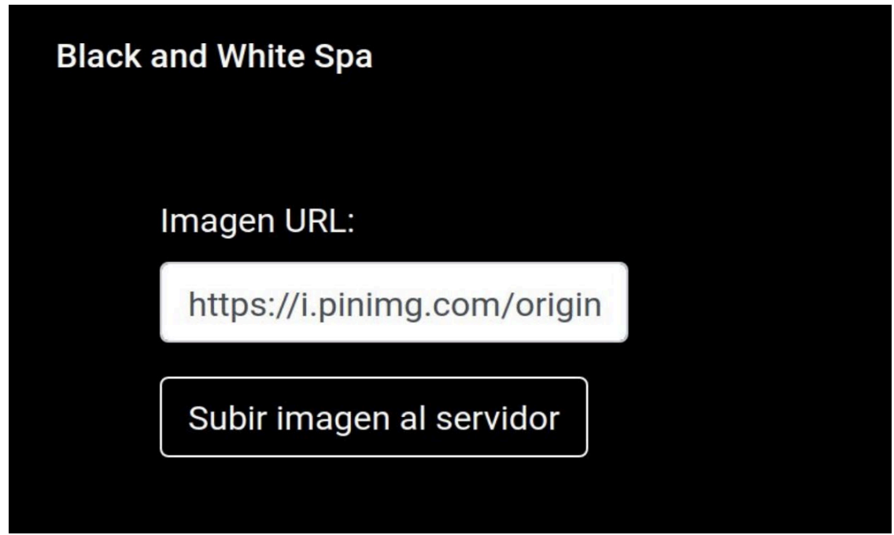
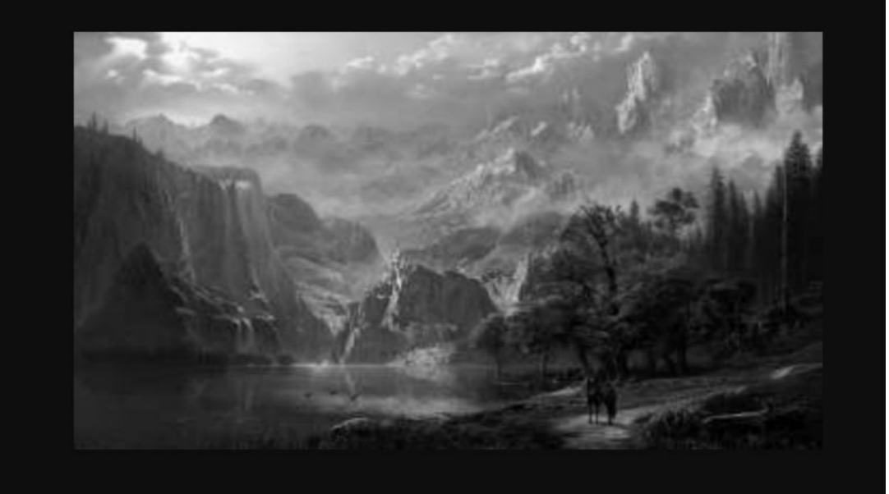

## Bootcamp desarrollo fullstack Javascript

**Módulo 6 - Grupal 4 - Grupo 3**

## Descripción de la Evaluación

La empresa Black and White Spa está promocionando una campaña para las redes sociales en donde
quieren ofrecer un sitio web que permita escribir la URL de una imagen de internet y que ésta sea
procesada por el servidor para ser devuelta en blanco y negro.

Deberás crear un servidor que disponibiliza una ruta raíz que devuelva un HTML con el formulario para
ingresar la URL de la imagen con estilos CSS de un documento interno en los archivos del servidor. El
formulario debe redirigir a otra ruta del servidor que procese la imagen y la devuelva en blanco y negro.
Como muestran las siguientes imágenes:

_Imagen 1 – Formulario de ingreso de imágenes_

_Imagen 2 – Resultado esperado de la imagen ingresada._

## Consideraciones generales

1. El servidor debe ser levantado por instrucción de una aplicación Node que use el paquete Yargs
   para capturar los argumentos en la línea de comando. Se deberá ejecutar el comando para levantar
   el servidor solo si el valor de la propiedad “key” es la correcta (123).
2. El servidor debe disponibilizar una ruta raíz que devuelva un HTML con el formulario para el ingreso
   de la URL de la imagen a tratar.

3. Los estilos de este HTML deben ser definidos por un archivo CSS alojado en el servidor.

4. El formulario debe redirigir a otra ruta del servidor que deberá procesar la imagen tomada por la
   URL enviada del formulario con el paquete Jimp. La imagen debe ser procesada en escala de
   grises, con calidad a un 60% y redimensionada a unos 350px de ancho. Posteriormente debe ser
   guardada con nombre “newImg.jpg” y devuelta al cliente.
